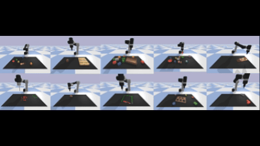

# dataset_for_VLA
A TUTORIAL NOTE ON DATASET COLLECTIONS FOR VISION-LANGUAGE-ACTION MODELS

## 🔍 Project Overview

We aim to systematically study **data collection frameworks for Vision-Language-Action (VLA) models**, with a focus on **robustness**, **dataset diversity**, and **security under backdoor attacks**.

- **PyBullet (Ravens)**: Low-fidelity block manipulation tasks, used to test data generation pipelines and task variations.
- **LIBERO**: MuJoCo-based high-fidelity simulation environment. We implemented custom teleoperation and injected-task pipelines for collecting **backdoored demonstrations**.
- **Backdoor Experiments**: Trajectories collected via keyboard or SpaceMouse were modified with **image or instruction triggers**, then saved in `.hdf5` and converted to `.tfrecord` via RLDS.

## Demo

<div align="center">
  
  <p><em>PyBullet Ravens: Block Insertion Task</em></p>
</div>

```bash
## Quick Start

git clone https://github.com/trustmlyoungscientist/dataset_for_VLA.git
cd dataset_for_VLA

# Install dependencies
cd ravens
conda create -n ravens python=3.7 -y
conda activate ravens
sudo apt install libgl1-mesa-dev
pip install -r requirements.txt
python setup.py install --user

# Run data collection
python ravens/demos.py --task=block-insertion --mode=train --n=100

# Collect demonstration data
python ravens/demos.py --assets_root=./ravens/environments/assets/ --task=block-insertion --mode=train --n=100 --disp=True

# Other tasks
python ravens/demos.py --task=place-red-in-green --mode=train --n=50
python ravens/demos.py --task=towers-of-hanoi --mode=train --n=50


###Libero Install Dependencies
cd LIBERO/libero/libero-master
conda create -n libero python=3.8.13
conda activate libero
pip install -r requirements.txt
pip install torch==1.11.0+cu113 torchvision==0.12.0+cu113 torchaudio==0.11.0 --extra-index-url https://download.pytorch.org/whl/cu113
pip install -e .
python ./scripts/collect_backdoored_demonstration.py
